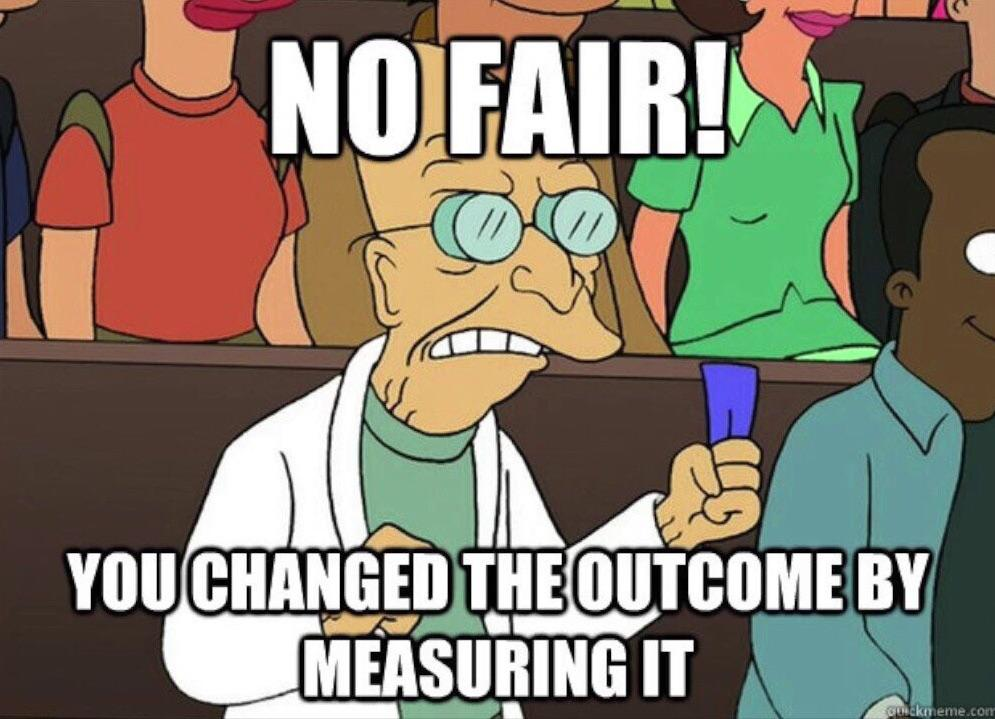

# Quantum physics 101

_Nature uses only the longest threads to weave her patterns, so each small piece of her fabric reveals the organization of the entire tapestry._

 Richard Feynman 

## Introduction

{ title="Quantum computer hardware based on superconducting circuits" }

Let us run a thought experiment: imagine your collection of cups, which is comprised of both tumblers and mugs, with both a mix of glass and ceramic. Being someone that is happier when everything is in its place, you decide that you are going to sort your cups into separate cupboards as determined by their shape, and confident in your ability to pull out a specific without looking mug based on touch alone.

It would turn out that you were hosting a morning tea, so were required to pull out _many_ cups, but fortunately you were prepared. However, when you reached into the cupboard of mugs and pulled out only ceramic cups, there was a 50/50 chance that you would pull out a tumbler! Flummoxed, you reach into the cupboard of tumblers, and pull out all of the ceramic cups and one again, you are now pulling out mugs 50% of the time.

Convinced that your kitchen just had a bad day, you sort your cups into cupboards based on their material, certain in your ability to pull out cups based solely on their shape. Your next morning tea roles around, and once again, when you go rummaging based on shape, you are only capable of pulling out a mixture of tumblers and mugs! Upon investigating your kitchen cupboards, you spy a tiny engraving which reads _quantum cabinetry_. What is that about? You enrol in a quantum mechanics course to find out.

??? warning "Futurama meme"
    A somewhat different tone, but both too relevant and too classic to pass up (from [S03E14: Time Keeps On Slippin'](https://www.imdb.com/title/tt0584462/)).

    <figure markdown>
      { width="500" align=right}
    </figure>

---

The study of quantum mechanics is a wild ride: it is punctuated by brief periods of understanding and then profound lulls of nothing making sense. It is often stated that quantum mechanics is counter intuitive, or that it cannot be understood, and whilst there one can argue that a deeper level this is true, one can use the scientific method to probe the universe, and formulate theories which accurately predict what will take place (with extraordinary accuracy!). Repeated exposure to commonly encountered systems and physical situations can be used to cultivate an intuition for might be likely to take place. If you come seeking explanations for quantum phenomena through analogy with "intuitive" classical systems, you will leave (mostly) empty handed. The best thing one can do to harness the power of quantum mechanics is take one's time: really marinate in the content. Build on the foundations of your existing physics knowledge (e.g. wave mechanics) and embark on a journey to harness the best model we have for the natural world.

<figure markdown>
  
</figure>

---

!!! info "Image credits"

    Header image taken from [IBM quantum systems](https://www.ibm.com/quantum/systems).
